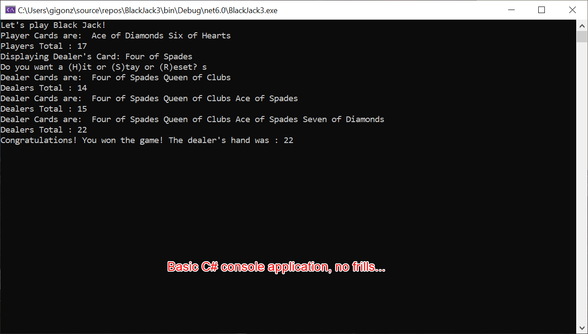

# BlackJack21
Black Jack game using most of the game rules and logic. 
## Motivation
Experimenting with C# and this seemed to be a great project to start with.
## Build status
Self-contained C# Console Application. 
## Screenshots

## Tech/Framework
Visual Studio 2022, C#
## How to use?
This is a standard C# console application.  
1.	Just download this to you preferred computer location.  
2.	Locate the .sln file with visual studio.
3.	‘Click’ on it and It should launch.
## Credits
Special thanks to [Darren Kuefner]( https://www.linkedin.com/in/darren-kuefner/) developer, sherpa and mentor. 
## License
It probably doesn’t need any kind of licensing, but in keeping with GitHub’s preferred practices and recommendations. I have placed this under the provisions and guidelines of an MIT License. 
MIT © [Gilbert Gonzales]()

